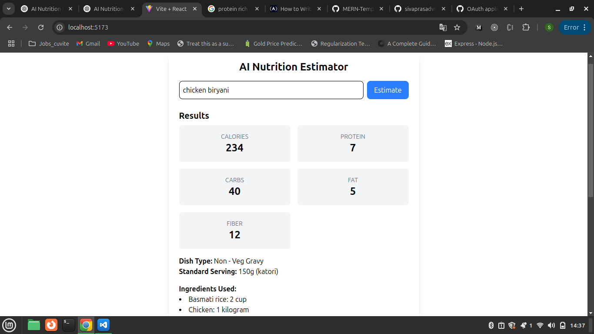

# AI Nutrition Estimator

**Project Title:** AI Nutrition Estimator

## Project Description

AI Nutrition Estimator is a MERN‑stack application that empowers users to estimate the nutritional content of home‑cooked Indian dishes per standard household serving. By leveraging a combination of:
- A nutrition database (IFCT‑2017)
- Standardized household measures
- Fuzzy ingredient matching
- Optional LLM‑based recipe fetching (OpenAI)

It delivers:
- Total calories, protein, carbs, fat, and fiber per serving
- Dish classification (e.g., Wet Sabzi, Dals, Hot Beverages)
- Ingredient breakdown with original and standardized quantities

**Technologies Used:**
- **Backend:** Node.js, Express, MongoDB, Mongoose
- **Matching:** Fuse.js for fuzzy search
- **LLM:** OpenAI (optional)
- **Frontend:** React, Vite, Tailwind CSS

**Challenges & Future Features:**
- Parsing messy real‑world ingredient names and units
- Scaling to regional recipe variations

---

## Table of Contents
1. [Getting Started](#getting-started)
2. [Project Structure](#project-structure)
3. [Installation & Setup](#installation--setup)
4. [Usage](#usage)
5. [API Endpoint](#api-endpoint)
6. [Input/Output Examples](#inputoutput-examples)
7. [Available Scripts](#available-scripts)
8. [Integrating OpenAI API Using GitHub Free Access](#Integrating OpenAI API Using GitHub Free Access)

---

## Getting Started

This repository provides both the client and server for a MERN‑stack app. To bootstrap your own project:
1. Clone this repo as a template.
2. Install dependencies.
3. Run frontend and backend concurrently for development.

---

## Project Structure

```
AI-nutrition-estimator/
├── backend/                 # Express API
│   ├── config/              # DB config example (git‑ignored)
│   ├── data/                # Nutrition CSV, household measures JSON
│   ├── models/              # Mongoose schemas (Ingredient, Category)
│   ├── routes/              # Express routers (api.js)
│   ├── controllers/         # Business logic orchestration
│   ├── service/             # Recipe fetch, classification
│   ├── utils/               # Conversion & matching utils
│   ├── scripts/             # DB seeder, CLI script
│   └── src/app.js           # Express server setup (CORS, JSON)
├── frontend/                # Vite + React + Tailwind UI
│   ├── public/              # Static files
│   ├── src/
│   │   ├── components/      # DishInput.jsx, NutritionResult.jsx
│   │   ├── App.jsx          # Main application
│   │   └── main.jsx         # React bootstrap
│   ├── index.html           # Entry HTML
│   ├── vite.config.js       # Dev server & proxy config
│   └── tailwind.config.js   # Tailwind setup
├── .gitignore
└── README.md                # Project overview and instructions
```

---

## Installation & Setup

### Prerequisites
- Node.js (>= v18)
- npm or yarn
- MongoDB (local or Atlas)

### Backend
```bash
cd backend
npm install
# Start dev server (with nodemon)
npm run dev
```

### Frontend
```bash
cd frontend
npm install
npm run dev
# Open http://localhost:5173 in your browser
```

---

## Usage

1. Navigate to the frontend at `http://localhost:5173`.
2. Enter a dish name (e.g., `Paneer Butter Masala`).
3. Click **Estimate** to view per‑serving nutrition, dish type, and ingredients.



---

## API Endpoint

**POST** `/api/estimate`

**Request Body:**
```json
{ "dish": "Your Dish Name" }
```

**Response:**
```json
{
  "estimated_nutrition_per_standard_serving": {
    "calories": <number>,
    "protein": <number>,
    "carbs": <number>,
    "fat": <number>,
    "fiber": <number>
  },
  "dish_type": "Category Name",
  "standard_serving": "<weight> (<unit>)",
  "ingredients_used": [
    { "ingredient": "Name", "quantity": "X unit" },
    …
  ]
}
```

---

## Input/Output Examples

| Dish Name               | Dish Type      | Serving           | Calories | Protein | Carbs | Fat | Fiber |
|-------------------------|----------------|-------------------|----------|---------|-------|-----|-------|
| Paneer Butter Masala    | Veg Gravy      | 150g (katori)     | 320      | 12      | 10    | 22  | 2     |
| Dal Tadka               | Dals           | 150g (katori)     | 180      | 9       | 25    | 5   | 6     |
| Chicken Biryani         | Dry Rice Item  | 124g (katori)     | 420      | 11      | 50    | 15  | 2     |
| Vegetable Stir‑Fry      | Veg Fry        | 100g (katori)     | 150      | 4       | 12    | 8   | 3     |
| Masala Chai             | Hot Beverages  | 250ml (cup)       | 120      | 4       | 14    | 6   | 0     |

---

**Sample Output:**
```
Estimation for "Chole Bhature":
- Serving: 150g (katori)
- Calories: 280
- Protein: 8g
- Carbs: 32g
- Fat: 10g
- Fiber: 5g
- Dish Type: Dals
```

---

## Available Scripts

In the root directory, run:

### `npm run install`
Installs dependencies in both `/backend` and `/frontend`.

### `npm run dev`
Runs both backend and frontend concurrently (via `concurrently`).

### `npm run build`
Builds the frontend for production.

### `npm start`
Launches the production server (after `npm run build`).

---

# 🔗 Integrating OpenAI API Using GitHub Free Access

This guide explains how to securely create an OpenAI API secret key using GitHub's free access and fetch base code from GitHub Marketplace to make OpenAI requests in your preferred language.

---

## 🔐 Generate OpenAI Secret Key via GitHub

1. Go to your [GitHub profile](https://github.com)
2. Click on `Settings`
3. Navigate to `Developer settings`
4. Click on `Personal access tokens` → `Tokens (classic)`
5. Generate a new token with the necessary scopes
6. Use this token securely in your project (for example, in a `.env` file)

```env
OPENAI_API_KEY=your_generated_api_key_here


**Enjoy exploring nutrition with AI!**

